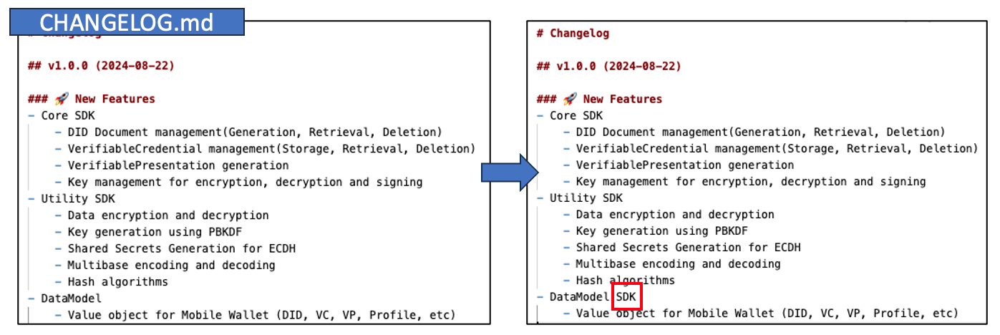

# GitHub를 통한 컨트리뷰션 절차 가이드

## 컨트리뷰션 대상

| 기여대상  | 내용                      |
|---------|--------------------------|
| 소스코드| 코드 품질 개선, 기능 추가, 버그 수정, 최적화, 테스트 코드 작성 및 리팩토링 작업|
| 문서 | 프로젝트 문서 업데이트, API 문서 작성, 사용 예제 추가 및 번역 작업|
| 템플릿 개선 | Issue,  PR 제출, 버그 보고, 기능 제안, 보안 취약점 보고 등의 템플릿을 개선하거나 새로운 템플릿을 추가하여 프로젝트 참여자들이 일관된 형식을 따를 수 있도록 기여 가능|
| GitHub Action 설정| CI/CD 자동화 파이프라인 구축 및 향상. 빌드/배포 자동화, 테스트 자동화, 코드 분석 도구 통합 등|
| 테스트 | 자동화된 테스트 케이스 작성 및 개선. 유닛 테스트, 통합 테스트 등|
| 이슈해결 및 관리 | 기존 이슈 해결, 새로운 이슈 제기, 버그 보고, 피드백 제공 및 기능 제안을 통한 프로젝트 개선 |
| 보안 | 보안 취약점 발견 및 수정, 보안 정책 작성, 의존성 업데이트 등을 통한 보안 강화 |

## 컨트리뷰션 절차
- 개인 GitHub 계정(예시: k3255)으로, 컨트리뷰션을 원하는 프로젝트(예시:OmniOneID/did-client-sdk-aos)를 Fork한다.


- 자신의 GitHub 계정에 있는 Fork된 Repository를 개발 환경에 Clone한다.


`$ git clone https://github.com/k3255/did-client-sdk-aos.git`

- Clone된 디렉토리에 들어가서, Git의 Repository 상태를 확인한다.

`$ cd did-client-sdk-aos`

`$ git remote -v`
```
origin	https://github.com/k3255/did-client-sdk-aos.git (fetch)
origin	https://github.com/k3255/did-client-sdk-aos.git (push)
```

- Remote repository를 추가로 지정한다.

`$ git remote add upstream https://github.com/OmniOneID/did-client-sdk-aos.git`

`$ git remote -v`
```
origin	https://github.com/k3255/did-client-sdk-aos.git (fetch)
origin	https://github.com/k3255/did-client-sdk-aos.git (push)
upstream	https://github.com/OmniOneID/did-client-sdk-aos.git (fetch)
upstream	https://github.com/OmniOneID/did-client-sdk-aos.git (push)
```

- Upstream 저장소의 최신 내용을 fetch(정보 업데이트)한다.

`$ git fetch upstream`

- 작업의 Base가 되는 Upstream의 특정 브랜치(예: main)로 checkout(이동, 해당 브랜치의 File들을 Local에 적용) 한다.

`$ git checkout upstream/main`

- 작업할 임시 브랜치를 생성(`-b` 옵션)하고, 해당 브랜치로 Checkout한다.

`$ git checkout -b feature/modify-document`
```
Switched to a new branch 'feature/modify-document'
```

`$ git branch`
```
* feature/modify-document
  main
```

- 원하는 내용 수정 (예시: CHANGELOG.md)



- 변경된 사항으로 빌드 및 테스트 진행하여 이상없는지 확인
- Git 상태 확인 (not staged된 파일을 확인)

`$ git status`
```
On branch feature/modify-document
Changes not staged for commit:
  (use "git add <file>..." to update what will be committed)
  (use "git restore <file>..." to discard changes in working directory)
	modified:   CHANGELOG.md

no changes added to commit (use "git add" and/or "git commit -a")
```

`$ git diff`
```
diff --git a/CHANGELOG.md b/CHANGELOG.md
index 4031c54..b51e4a5 100644
--- a/CHANGELOG.md
+++ b/CHANGELOG.md
```

- Upstream에 커밋할 파일을 스테이징한다. (여러개의 수정된 파일들을 스테이징할 수 있다.)

`$ git add CHANGELOG.md`

`$ git status`
```
On branch feature/modify-document
Changes to be committed:
  (use "git restore --staged <file>..." to unstage)
	modified:   CHANGELOG.md
```

- 스테이징된 파일들을 커밋한다. 이때 1줄 커밋 메시지는 이해하기 쉽게 작성한다.

`$ git commit -m "docs: update CHANGELOG.md"`
```
[feature/modify-document 09870dd] docs: update CHANGELOG.md
 1 file changed, 1 insertion(+), 1 deletion(-)
```

`$ git status`
```
On branch feature/modify-document
nothing to commit, working tree clean
```

- Upstream repository의 최신 작업 내용을 Fetch 받아온다. (필수이며 생략하면 안됨. 상시로 확인하는 것도 좋은 방법.)

`$ git fetch upstream`

- Upstream repository의 최신 작업 내용 쪽으로 Rebase 한다. 이때 Repository의 최신 상태와 Conflict가 있으면, 컨트리뷰터가 반드시 해결을 하고, 다음 절차를 진행해야 한다.

`$ git rebase upstream/main`
```
Current branch feature/modify-document is up to date.
```

- 본인의 GitHub repository에 작업 브랜치를 Push 한다.

`$ git push origin feature/modify-document`
```
Enumerating objects: 5, done.
Counting objects: 100% (5/5), done.
Delta compression using up to 10 threads
Compressing objects: 100% (3/3), done.
Writing objects: 100% (3/3), 300 bytes | 300.00 KiB/s, done.
Total 3 (delta 2), reused 0 (delta 0), pack-reused 0
remote: Resolving deltas: 100% (2/2), completed with 2 local objects.
remote: 
remote: Create a pull request for 'feature/modify-document' on GitHub by visiting:
remote:      https://github.com/k3255/did-client-sdk-aos/pull/new/feature/modify-document
remote: 
To https://github.com/k3255/did-client-sdk-aos.git
 * [new branch]      feature/modify-document -> feature/modify-document
```

- GitHub의 Fork 받아 온 Repository에 접속하면, “Compare & pull request”가 활성화 된다. 이를 클릭하여, PR 생성을 한다.


- 생성된 PR을 확인하고, Reviewers와 Assignees를 지정한다.


- reviewer가 승인 의견을 남긴 후, 승인자가 해당 PR을 main branch로 Merge한다.
